---
## Front matter
lang: ru-RU
title: Отчёт по лабораторной работе 2
author: 'Дзугаева Лилия Владиславовна'

## Formatting
toc: false
slide_level: 2
theme: metropolis
mainfont: PT Serif 
romanfont: PT Serif
sansfont: PT Sans
monofont: PT Mono
header-includes: 
 - \metroset{progressbar=frametitle,sectionpage=progressbar,numbering=fraction}
 - '\makeatletter'
 - '\beamer@ignorenonframefalse'
 - '\makeatother'
aspectratio: 43
section-titles: true
---

## Цель работы

Получение практических навыков работы в консоли с атрибутами файлов, закрепление теоретических основ дискреционного разграничения до-ступа в современных системах с открытым кодом на базе ОС Linux.

## Задание

Лабораторная работа подразумевает работу с виртуальной машиной _VirtualBox_ операционной системы _Linux_, дистрибутив _Centos_, с консолью и атрибутами файлов.

# Выполнение лабораторной работы

1. В установленной при выполнении предыдущей лабораторной работы операционной системе создаю учётную запись пользователя _guest_ - задаю имя пользователя и пароль. (рис. 1)

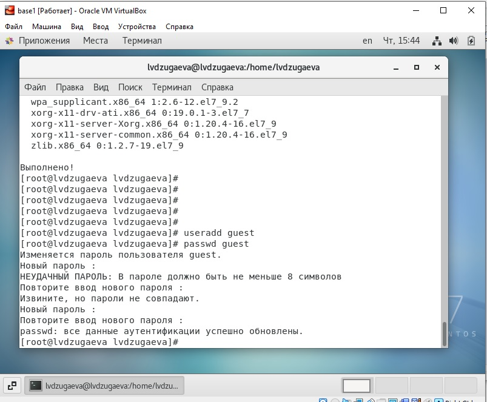{ #fig:001 width=70% }

2. Захожу в систему под именем пользователя _guest_. (рис. 2-3)

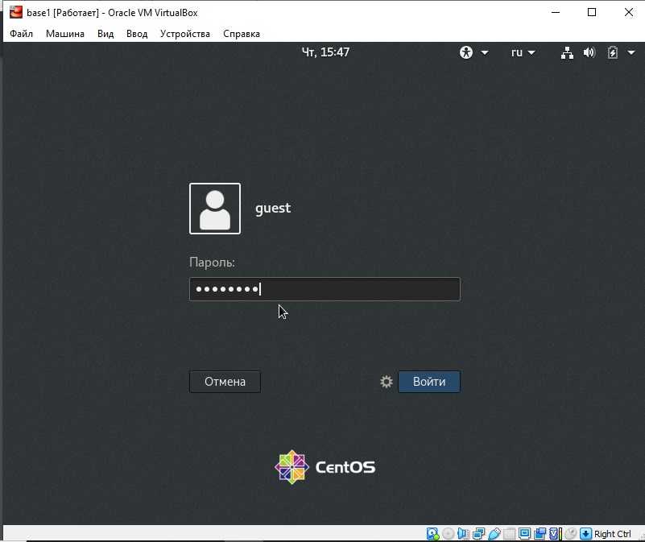{ #fig:001 width=70% }
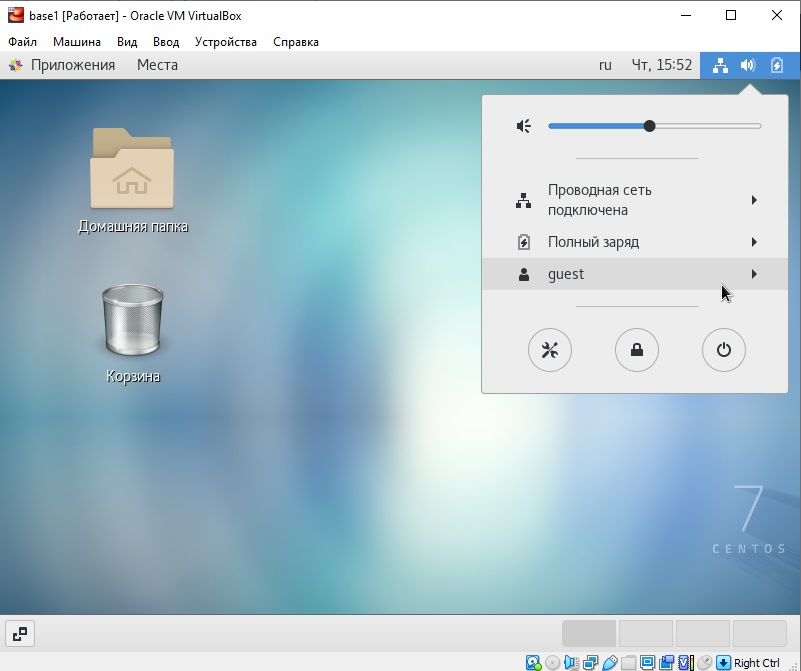{ #fig:001 width=70% }

3. Определяю директорию, в которой нахожусь, командой _pwd_. Сравниваю её с приглашением командной строки. Определяю какая это директория.  (рис. 4)

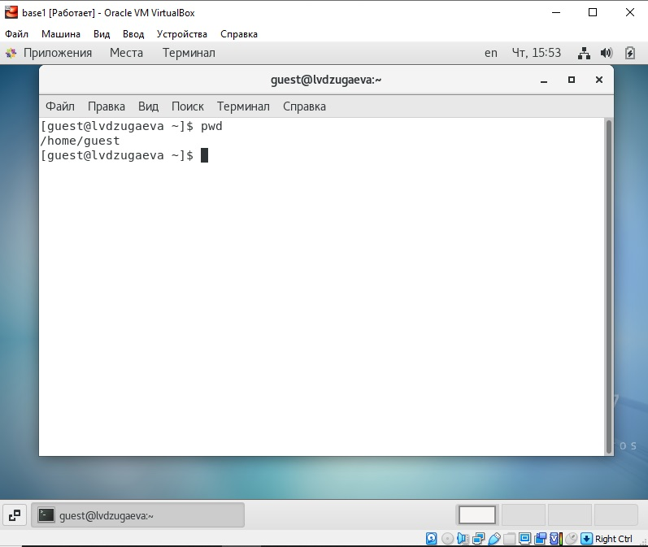{ #fig:001 width=70% }

4. Уточняю имя моего пользователя командой _whoami_. (рис. 5)

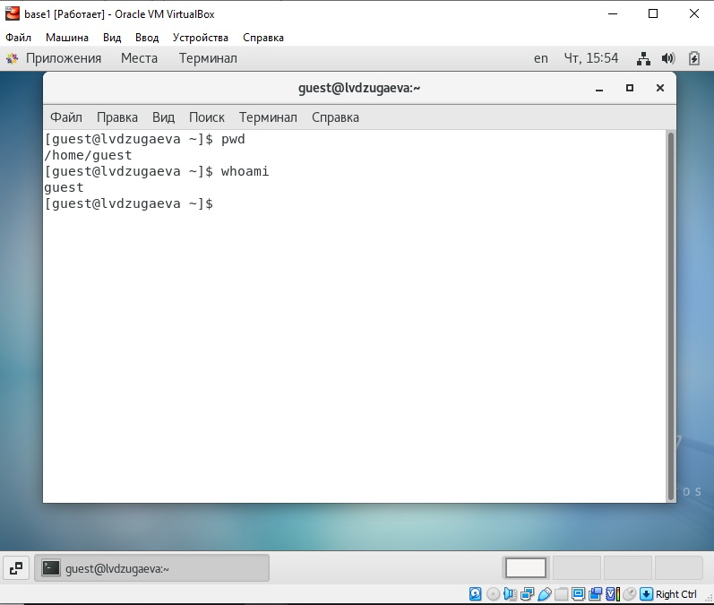{ #fig:001 width=70% }

5. Уточняю имя моего пользователя, его группу, а также группы, куда входит пользователь, командой _id_. Выведенные значения _uid_, _gid_ и др. запоминаю. Сравниваю вывод _id_ с выводом команды _groups_. (рис. 6-7)

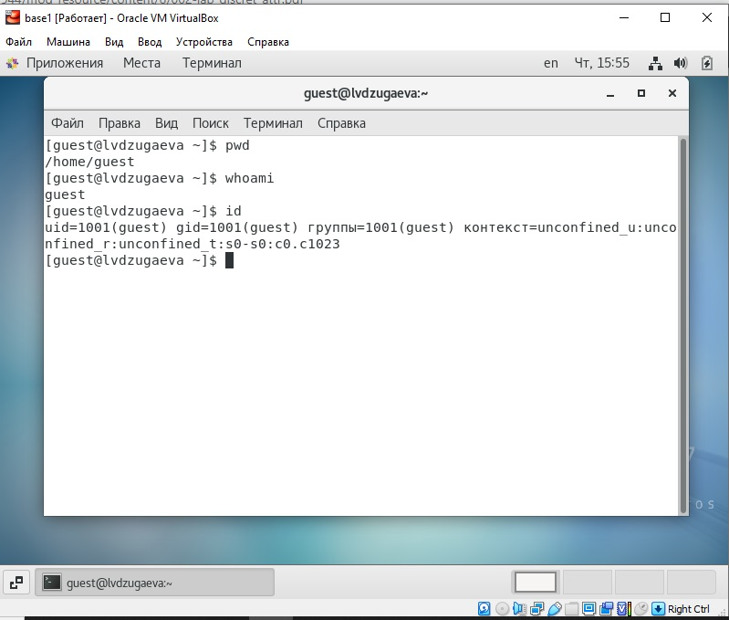{ #fig:001 width=70% }
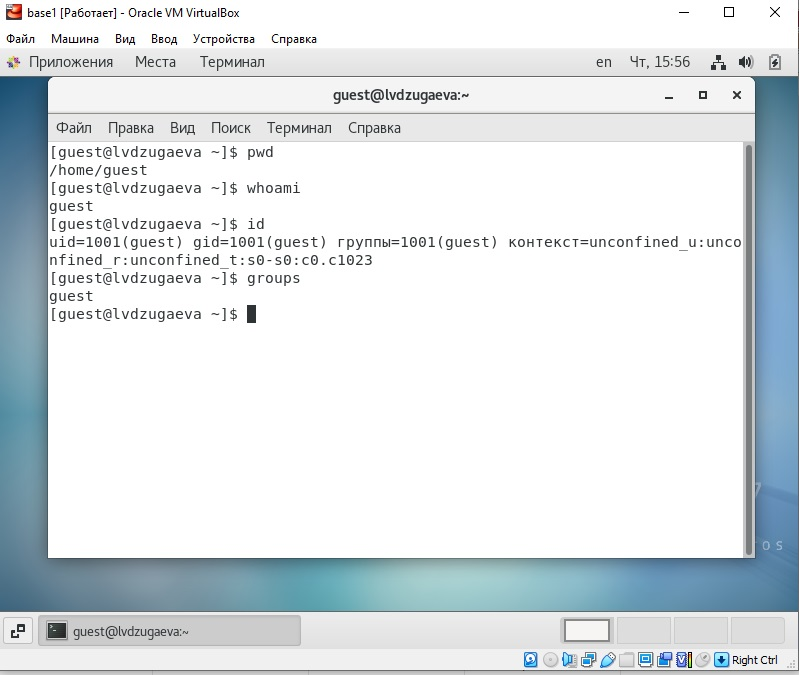{ #fig:001 width=70% }

6. Просмотриваю файл _/etc/passwd_ командой _cat /etc/passwd_. Найду в нём свою учётную запись. Определяю uid пользователя. Определяю gid пользователя. Сравниваю найденные значения с полученными в предыдущих пунктах. (рис. 8)

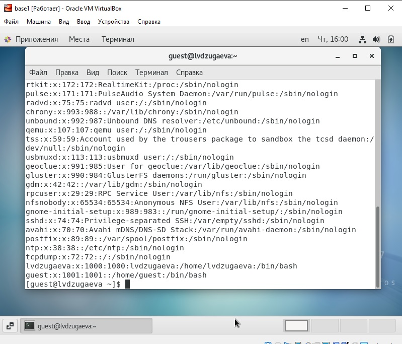{ #fig:001 width=70% }

7. Определяю существующие в системе директории командой _ls -l /home/_ (рис. 9)

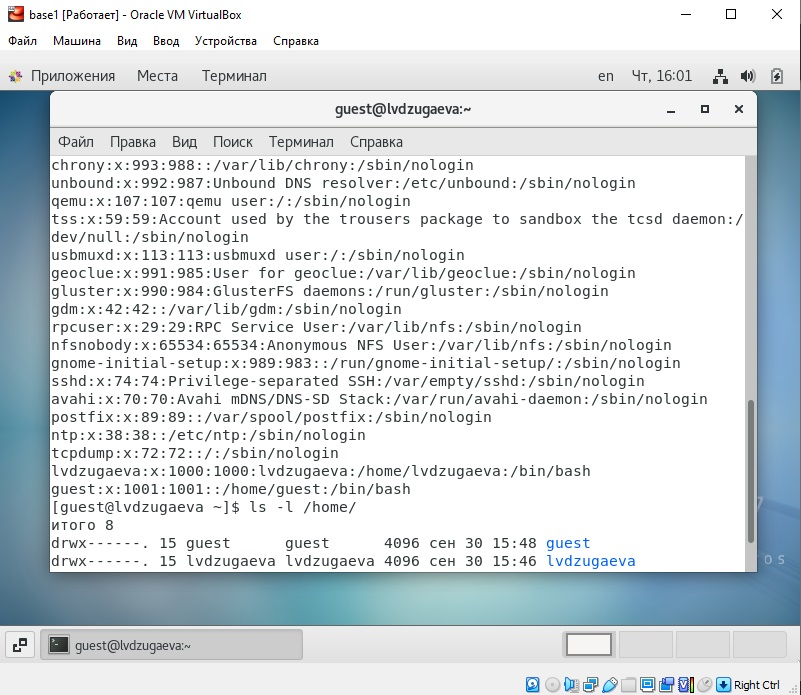{ #fig:001 width=70% }

8. Проверяю, какие расширенные атрибуты установлены на поддиректориях, находящихся в директории _/home_, командой: _lsattr /home_ (рис. 10)

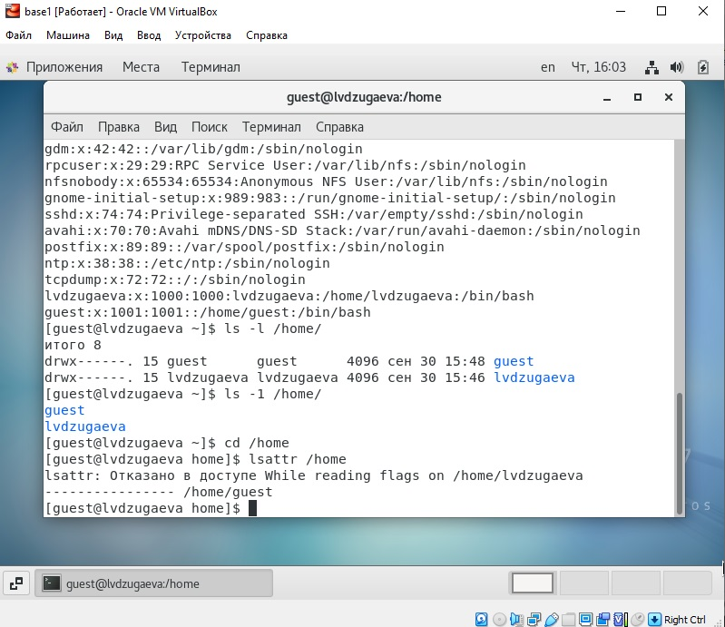{ #fig:001 width=70% }

9. Создаю в домашней директории поддиректорию _dir1_ командой _mkdir dir1_. Определяю командами _ls -l_ и _lsattr_, какие права доступа и расширенные атрибуты были выставлены на директорию _dir1_. (рис. 11-12)

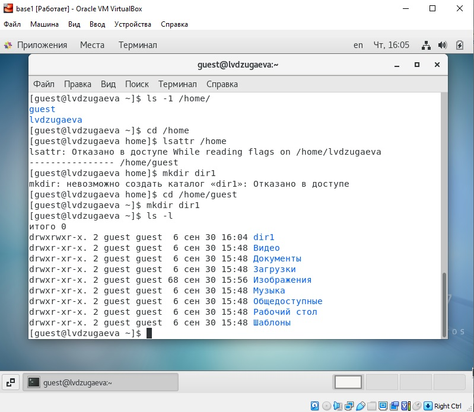{ #fig:001 width=70% }
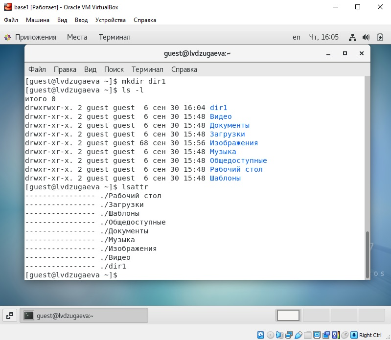{ #fig:001 width=70% }

10. Снимаю с директории _dir1_ все атрибуты командой _chmod 000 dir1_ и проверяю с её помощью правильность выполнения команды _ls -l_. (рис. 13)

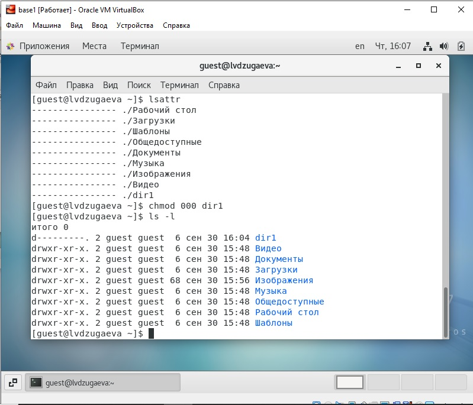{ #fig:001 width=70% }

11. Создаю в директории _dir1_ файл _file1_ командой _echo "test" > /home/guest/dir1/file1_. Проверяю командой _ls -l /home/guest/dir1_ действительно ли файл _file1_ не находится внутри директории _dir1_. (рис. 14-15)

{ #fig:001 width=70% }
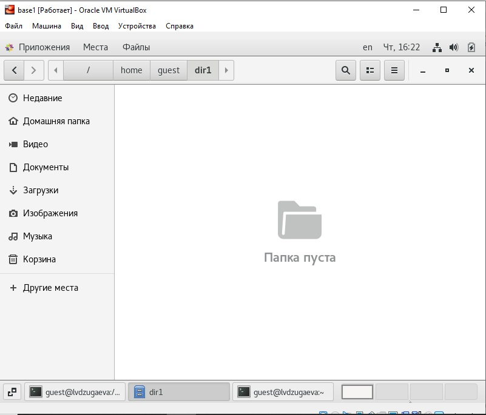{ #fig:001 width=70% }

# Выводы

Приобрел практические навыки работы в консоли с атрибутами файлов, закрепила теоретические основы дискреционного разграничения доступа в современных системах с открытым кодом на базе ОС Linux.

## {.standout}

Спасибо за внимание
