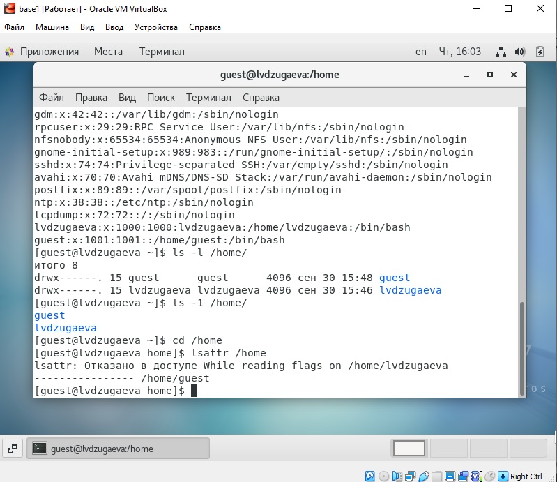

---
# Front matter
title: "Отчёт по лабораторной работе"
subtitle: "Лабораторная работа 2"
author: "Дзугаева Лилия Владславовна"

# Generic otions
lang: ru-RU
toc-title: "Содержание"

# Bibliography
bibliography: bib/cite.bib
csl: pandoc/csl/gost-r-7-0-5-2008-numeric.csl

# Pdf output format
toc: true # Table of contents
toc_depth: 2
lof: true # List of figures
lot: true # List of tables
fontsize: 12pt
linestretch: 1.5
papersize: a4
documentclass: scrreprt
## I18n
polyglossia-lang:
  name: russian
  options:
	- spelling=modern
	- babelshorthands=true
polyglossia-otherlangs:
  name: english
### Fonts
mainfont: PT Serif
romanfont: PT Serif
sansfont: PT Sans
monofont: PT Mono
mainfontoptions: Ligatures=TeX
romanfontoptions: Ligatures=TeX
sansfontoptions: Ligatures=TeX,Scale=MatchLowercase
monofontoptions: Scale=MatchLowercase,Scale=0.9
## Biblatex
biblatex: true
biblio-style: "gost-numeric"
biblatexoptions:
  - parentracker=true
  - backend=biber
  - hyperref=auto
  - language=auto
  - autolang=other*
  - citestyle=gost-numeric
## Misc options
indent: true
header-includes:
  - \linepenalty=10 # the penalty added to the badness of each line within a paragraph (no associated penalty node) Increasing the value makes tex try to have fewer lines in the paragraph.
  - \interlinepenalty=0 # value of the penalty (node) added after each line of a paragraph.
  - \hyphenpenalty=50 # the penalty for line breaking at an automatically inserted hyphen
  - \exhyphenpenalty=50 # the penalty for line breaking at an explicit hyphen
  - \binoppenalty=700 # the penalty for breaking a line at a binary operator
  - \relpenalty=500 # the penalty for breaking a line at a relation
  - \clubpenalty=150 # extra penalty for breaking after first line of a paragraph
  - \widowpenalty=150 # extra penalty for breaking before last line of a paragraph
  - \displaywidowpenalty=50 # extra penalty for breaking before last line before a display math
  - \brokenpenalty=100 # extra penalty for page breaking after a hyphenated line
  - \predisplaypenalty=10000 # penalty for breaking before a display
  - \postdisplaypenalty=0 # penalty for breaking after a display
  - \floatingpenalty = 20000 # penalty for splitting an insertion (can only be split footnote in standard LaTeX)
  - \raggedbottom # or \flushbottom
  - \usepackage{float} # keep figures where there are in the text
  - \floatplacement{figure}{H} # keep figures where there are in the text
---

# Цель работы

Получение практических навыков работы в консоли с атрибутами файлов, закрепление теоретических основ дискреционного разграничения до-ступа в современных системах с открытым кодом на базе ОС Linux.

# Задание

Лабораторная работа подразумевает работу с виртуальной машиной _VirtualBox_ операционной системы _Linux_, дистрибутив _Centos_, с консолью и атрибутами файлов.

# Выполнение лабораторной работы

1. В установленной при выполнении предыдущей лабораторной работы операционной системе создаю учётную запись пользователя _guest_ - задаю имя пользователя и пароль. (рис. 1)

{ #fig:001 width=70% }

2. Захожу в систему под именем пользователя _guest_. (рис. 2-3)

{ #fig:001 width=70% }
{ #fig:001 width=70% }

3. Определяю директорию, в которой нахожусь, командой _pwd_. Сравниваю её с приглашением командной строки. Определяю какая это директория.  (рис. 4)

{ #fig:001 width=70% }

4. Уточняю имя моего пользователя командой _whoami_. (рис. 5)

{ #fig:001 width=70% }

5. Уточняю имя моего пользователя, его группу, а также группы, куда входит пользователь, командой _id_. Выведенные значения _uid_, _gid_ и др. запоминаю. Сравниваю вывод _id_ с выводом команды _groups_. (рис. 6-7)

{ #fig:001 width=70% }
{ #fig:001 width=70% }

6. Просмотриваю файл _/etc/passwd_ командой _cat /etc/passwd_. Найду в нём свою учётную запись. Определяю uid пользователя. Определяю gid пользователя. Сравниваю найденные значения с полученными в предыдущих пунктах. (рис. 8)

{ #fig:001 width=70% }

7. Определяю существующие в системе директории командой _ls -l /home/_ (рис. 9)

{ #fig:001 width=70% }

8. Проверяю, какие расширенные атрибуты установлены на поддиректориях, находящихся в директории _/home_, командой: _lsattr /home_ (рис. 10)

{ #fig:001 width=70% }

9. Создаю в домашней директории поддиректорию _dir1_ командой _mkdir dir1_. Определяю командами _ls -l_ и _lsattr_, какие права доступа и расширенные атрибуты были выставлены на директорию _dir1_. (рис. 11-12)

{ #fig:001 width=70% }
{ #fig:001 width=70% }

10. Снимаю с директории _dir1_ все атрибуты командой _chmod 000 dir1_ и проверяю с её помощью правильность выполнения команды _ls -l_. (рис. 13)

{ #fig:001 width=70% }

11. Создаю в директории _dir1_ файл _file1_ командой _echo "test" > /home/guest/dir1/file1_. Проверяю командой _ls -l /home/guest/dir1_ действительно ли файл _file1_ не находится внутри директории _dir1_. (рис. 14-15)

{ #fig:001 width=70% }
{ #fig:001 width=70% }

# Выводы

Приобрел практические навыки работы в консоли с атрибутами файлов, закрепила теоретические основы дискреционного разграничения доступа в современных системах с открытым кодом на базе ОС Linux.

# Список литературы{.unnumbered}

::: {#refs}
:::
